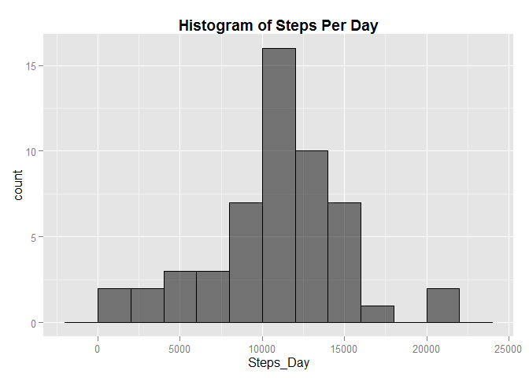
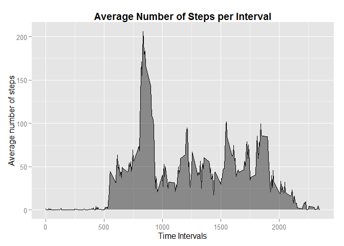
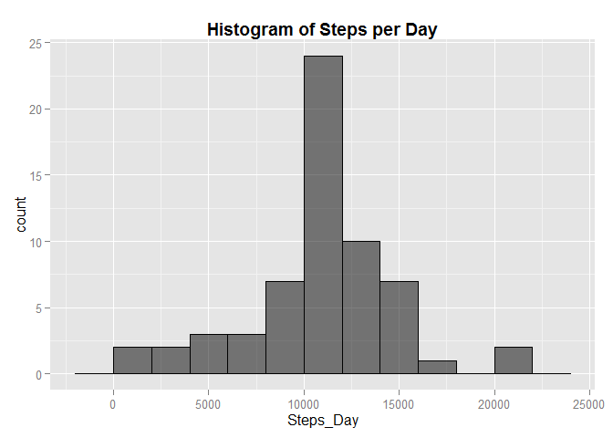
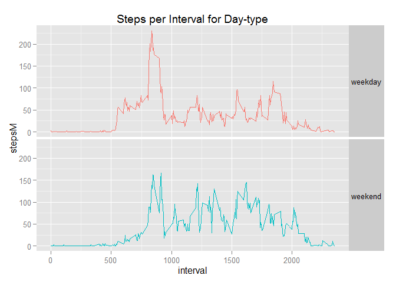

# **Reproducible Research: Peer Assessment 1**

## Loading and preprocessing the data

```r
library("lubridate")
library("dplyr")
library("ggplot2")
library("knitr")
```

```
## Warning: package 'knitr' was built under R version 3.2.3
```

```r
data <- read.csv("activity.csv", header= TRUE, colClasses = "character")
data$date <- ymd(data$date)
data$steps <- as.numeric(data$steps)
```

##What is mean total number of steps taken per day?

> *Calculate the total number of steps taken per day*


```r
stepsAday <- na.omit(data) %>%
  group_by(date) %>%
  summarize(Steps_Day = sum(steps))
stepsAday <- data.frame(stepsAday)
kable(head(stepsAday), align = "c")
```

    date       Steps_Day 
------------  -----------
 2012-10-02       126    
 2012-10-03      11352   
 2012-10-04      12116   
 2012-10-05      13294   
 2012-10-06      15420   
 2012-10-07      11015   

> *Make a histogram of the total number of steps taken each day*


```r
ggplot(stepsAday, aes(x=Steps_Day)) +
  geom_histogram( binwidth = 2000, colour="black", fill="black", alpha=0.5) +
  ggtitle("Histogram of Steps Per Day") + 
  theme(plot.title = element_text(lineheight=.8, face="bold")) 
```

 

<br>

> *Calculate and report the mean and median of the total number of steps taken per day*


```r
mean_median <- summarize(stepsAday, Steps_Day_mean = mean(Steps_Day), Steps_Day_median = median(Steps_Day))
kable(mean_median, align = "c")
```


 Steps_Day_mean    Steps_Day_median 
----------------  ------------------
    10766.19            10765       

## What is the average daily activity pattern?

> *Make a time series plot (i.e. type = "l") of the 5-minute interval (x-axis) and the average number of steps taken, averaged across all days (y-axis)*


```r
Interval <- na.omit(data)
Interval <- Interval[,-2] %>%
  group_by(interval) %>%
  summarize(mean = mean(steps))
Interval$interval <- as.numeric(Interval$interval)

ggplot(Interval, aes(x = interval, y = mean)) + 
  ggtitle("Average Number of Steps per Interval") + 
  theme(plot.title = element_text(lineheight=.8, face="bold"))+
  labs(y = "Average number of steps", x = "Time Intervals") +
  geom_area(fill="black", alpha=.4) +
  geom_line(size=.7)  
```

 

<br>

> *Which 5-minute interval, on average across all the days in the dataset, contains the maximum number of steps?*


```r
Interval <- na.omit(data)
Interval <- Interval[,-2] %>%
  group_by(interval) %>%
  summarize(mean = mean(steps))
Interval$interval <- as.numeric(Interval$interval)
data.frame(Interval[Interval[ ,2] == max(Interval$mean),1])
```

```
##   interval
## 1      835
```

## Imputing missing values
> *Calculate and report the total number of missing values in the dataset (i.e. the total number of rows with NAs)*


```r
sum(is.na(data))
```

```
## [1] 2304
```

> *Devise a strategy for filling in all of the missing values in the dataset. The strategy does not need to be sophisticated. For example, you could use the mean/median for that day, or the mean for that 5-minute interval, etc.*

Chose to loop through to look for NAs and replace them with the mean for that 5 minute interval.


```r
for (i in 1:nrow(data)) {
  if(is.na(data$steps[i])) {
    data$steps[i] <- Interval[Interval$interval == data$interval[i],2]
  }
}
```

> *Create a new dataset that is equal to the original dataset but with the missing data filled in.*


```r
data$steps <- as.numeric(data$steps)
data1 <- tbl_df(data) %>%
  group_by(date) %>%
  summarize(Steps_Day = sum(steps))
kable(head(data1), align = "c")
```

    date       Steps_Day 
------------  -----------
 2012-10-01    10766.19  
 2012-10-02     126.00   
 2012-10-03    11352.00  
 2012-10-04    12116.00  
 2012-10-05    13294.00  
 2012-10-06    15420.00  

> *Make a histogram of the total number of steps taken each day and Calculate and report the mean and median total number of steps taken per day. Do these values differ from the estimates from the first part of the assignment? What is the impact of imputing missing data on the estimates of the total daily number of steps?*

 

 Steps_Day_mean    Steps_Day_median 
----------------  ------------------
    10766.19           10766.19     

The above median value **DOES** differ slightly from the estimates from the first part of the assignment, but the mean is the same. Imputing missing data on the estimates of the total daily number of steps increased the total daily number of steps, as one would expect since we are adding additional data in place of NAs. This difference is visible when looking at both histograms. The y-axis of the histogram created from data without replacing NAs has a smaller limit.

## Are there differences in activity patterns between weekdays and weekends?

> *Create a new factor variable in the dataset with two levels - "weekday" and "weekend" indicating whether a given date is a weekday or weekend day.*


```r
data <- mutate(data,wkday = wday(data$date, label = TRUE)) %>%
  mutate(daytype = "")
  data$wkday <- as.character(data$wkday)
  
for(i in 1:nrow(data)){
  if (data$wkday[i] == "Sun" || data$wkday[i] =="Sat") {
  data$daytype[i] = "weekend"
  } else {
    data$daytype[i] = "weekday"
  }
}
  
kable(head(data), align = "c")
```


   steps         date       interval    wkday    daytype 
-----------  ------------  ----------  -------  ---------
 1.7169811    2012-10-01       0         Mon     weekday 
 0.3396226    2012-10-01       5         Mon     weekday 
 0.1320755    2012-10-01       10        Mon     weekday 
 0.1509434    2012-10-01       15        Mon     weekday 
 0.0754717    2012-10-01       20        Mon     weekday 
 2.0943396    2012-10-01       25        Mon     weekday 

> *Make a panel plot containing a time series plot (i.e. type = "l") of the 5-minute interval (x-axis) and the average number of steps taken, averaged across all weekday days or weekend days (y-axis).*


```r
 data$daytype <- as.factor(data$daytype)
 data <- group_by(data, daytype, interval)
 data <- mutate(data, stepsM = mean(steps)) %>%
   select(daytype, interval, stepsM)
 data$interval <- as.numeric(data$interval)

 ggplot(data, aes(interval, stepsM)) + 
   facet_grid(.~ daytype) +
   ggtitle("Steps per Interval for Day-type") +
   geom_line(aes(colour = daytype)) +
   theme(legend.position="none") 
```

 

Yes, there are differences in the activity patterns between weekdays and weekends. During weekdays the activity peak is earlier in the day whereas in the weekend the peaks are around the afternoon and activity is more consistent throughout, most likely as they are off for the weekend and have more time.
